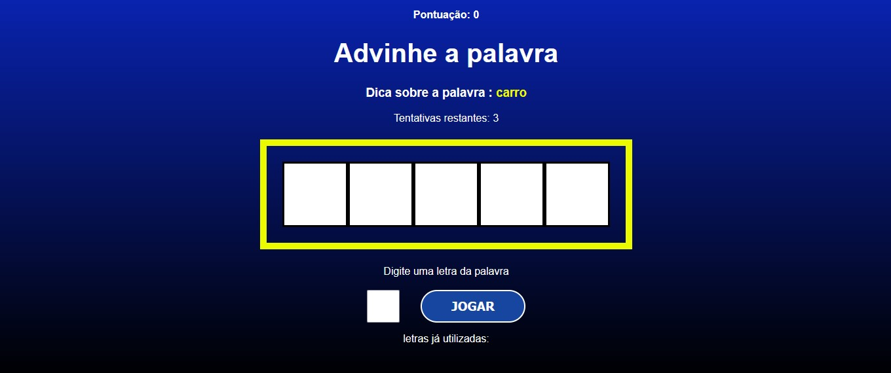

# Qual a palavra?

 

## Visão Geral

- [Visão geral](#visão-geral)
  - [O Projeto](#o-projeto)
  - [Instalação](#instalação)
  - [Contribuição](#contribuição)
  - [O que aprendi?](#o-que-aprendi)
  - [Links](#links)
  - [Contato](#contato)

## O Projeto

- Um jogo, inspirado num quadro de TV, onde o usuário tem 3 tentativas para advinhar qual a palavra que o computador deu a dica. Será que você consegue?

## Instalação
 - Certifique-se de ter o Node.js instalado em sua máquina.

    ### Clonar Repositório

        git clone https://github.com/mazziera/qual-a-palavra-react
    

    ### Instalar Dependências
        cd qual-a-palavra-vite
        npm install

    ### Inicializar o servidor de desenvolvimento
        npm run dev

    ### Comandos Disponíveis
        npm run dev: Inicia o servidor de desenvolvimento.
        npm run build: Constrói a aplicação para produção.
        npm run serve: Serve a aplicação construída localmente.

## Contribuição
- Contribuições são bem-vindas! Se você encontrar algum problema ou tiver sugestões para melhorias, sinta-se à vontade para abrir uma issue ou enviar um pull request.

## O que aprendi?

- Neste projeto pude por em prática, conceitos introdutórios e básicos de React, como a sintaxe JSX, componentização e importação de elementos html, utilizar diferentes hooks e também JavaScript puro, com funções e lógica de programação.

## Links
- Repositório: https://github.com/mazziera/qual-a-palavra-react
- Deploy: https://qual-a-palavra-react.vercel.app/

## Contato

- Github - [mazziera.io](https://github.com/mazziera)
- Linkedin - [@raphael-mazzieri](https://www.linkedin.com/in/raphael-mazzieri/)

### Extras
Currently, two official plugins are available:

- [@vitejs/plugin-react](https://github.com/vitejs/vite-plugin-react/blob/main/packages/plugin-react/README.md) uses [Babel](https://babeljs.io/) for Fast Refresh
- [@vitejs/plugin-react-swc](https://github.com/vitejs/vite-plugin-react-swc) uses [SWC](https://swc.rs/) for Fast Refresh
-    Documentação do React.js: https://reactjs.org/docs/getting-started.html
-    Documentação do Vite: https://vitejs.dev/guide/